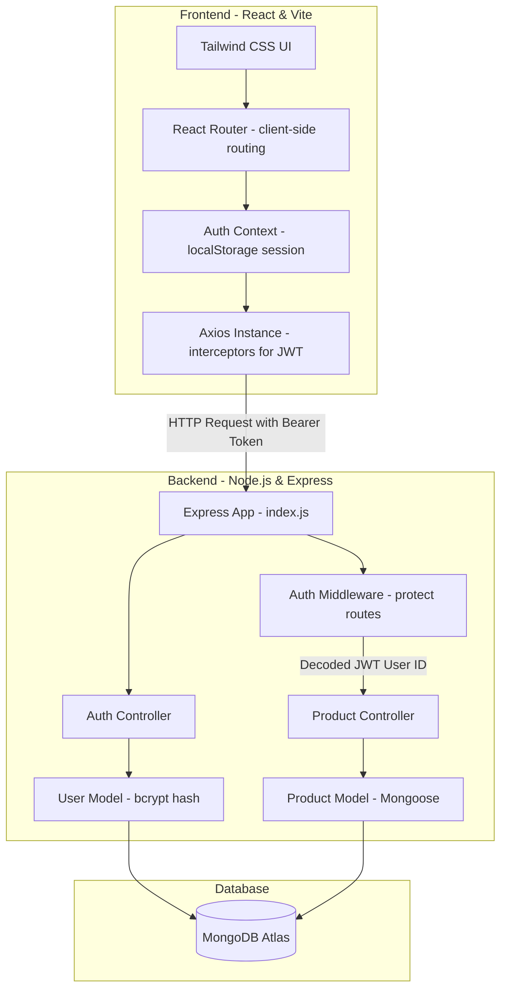
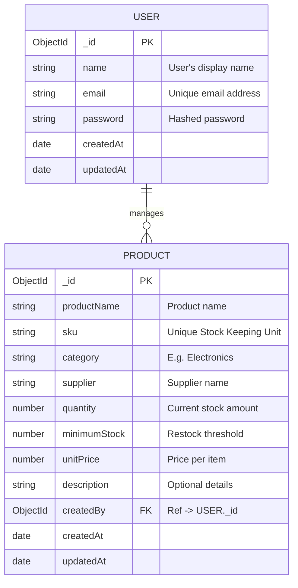

# StockWise – Smart Inventory Management System

StockWise is a realistic, production-inspired MERN stack web application built to help small shops and warehouses manage their inventory. Users can manage products, track stock levels, receive automated low-stock alerts, filter/search products, and view real-time dashboard analytics.

---

## 🛠️ Tech Stack

- **Frontend**: React (Vite), React Router v6, Tailwind CSS, Axios, React Hot Toast, React Icons
- **Backend**: Node.js, Express.js, JWT Authentication, bcryptjs
- **Database**: MongoDB, Mongoose ORM
- **Deployment**: Vercel (Frontend), Render (Backend), MongoDB Atlas (Database)

---

## 📊 System Architecture



---

## 💾 Database Schema Design



---

## 🚀 Deployment Instructions

### 1. MongoDB Atlas Setup
1. Sign up on [MongoDB Atlas](https://cloud.mongodb.com/).
2. Create a free shared cluster (M0).
3. Under **Database Access**, create a user with read/write permissions.
4. Under **Network Access**, whitelist `0.0.0.0/0` (Allow Access from Anywhere) for Render to connect.
5. Copy your connection string: `mongodb+srv://<username>:<password>@cluster.mongodb.net/stockwise?retryWrites=true&w=majority`.

### 2. Backend Deployment on Render
1. Create a new Web Service on [Render](https://render.com/).
2. Connect your Git repository.
3. Configure the settings:
   - **Environment**: `Node`
   - **Build Command**: `npm install` (run in `server` subdirectory)
   - **Start Command**: `node index.js`
4. Set the following **Environment Variables**:
   - `PORT`: `5000`
   - `MONGO_URI`: *Your MongoDB Atlas connection string*
   - `JWT_SECRET`: *A secure random string*
   - `JWT_EXPIRE`: `7d`
   - `NODE_ENV`: `production`

### 3. Frontend Deployment on Vercel
1. Create a project on [Vercel](https://vercel.com/) pointing to your Git repository.
2. Select `client` as the root directory.
3. Configure the build settings (Vercel automatically detects Vite):
   - **Framework Preset**: `Vite`
   - **Build Command**: `npm run build`
   - **Output Directory**: `dist`
4. Add the **Environment Variable**:
   - `VITE_API_URL`: *Your Render backend URL (e.g., https://stockwise-api.onrender.com/api)*
5. To support React Router client-side path handling, include a `vercel.json` file in your client directory:
   ```json
   {
     "rewrites": [{ "source": "/(.*)", "destination": "/index.html" }]
   }
   ```

---

## 📂 Project Structure

```
stockwise/
├── server/
│   ├── config/db.js          # Mongoose DB connection
│   ├── controllers/          # Business logic controllers
│   ├── middleware/           # Protect route middleware
│   ├── models/               # MongoDB models (User, Product)
│   ├── routes/               # Express routes
│   └── index.js              # Server entry point
└── client/
    ├── src/
    │   ├── components/       # Layout, Sidebar, ProtectedRoute, ProductModal, ConfirmDialog
    │   ├── context/          # AuthState & AuthContext
    │   ├── pages/            # Login, Register, Dashboard, Products, LowStock, NotFound
    │   ├── services/         # API instance (Axios) and endpoints
    │   ├── index.css         # Custom Tailwind directives & button utilities
    │   └── main.jsx          # Entry mount point
    ├── index.html            # Main SPA HTML
    └── tailwind.config.js    # Tailwind layout settings
```

---

## 🔧 Installation & Local Setup

1. **Clone the repository**:
   ```bash
   git clone <repo-url>
   cd stockwise
   ```

2. **Setup Server**:
   ```bash
   cd server
   npm install
   # Create a .env file based on .env.example
   npm run dev
   ```

3. **Setup Client**:
   ```bash
   cd ../client
   npm install
   # Create a .env file with VITE_API_URL=http://localhost:5000/api
   npm run dev
   ```
